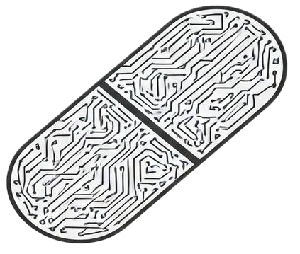

<h1 align="center">FHIR Dosage Support</h1>

Turn [FHIR Dosage](https://build.fhir.org/dosage.html) into human-readable text in your desired language and much more.

---

## Overview

Key Features:

- **Compatible:** Works with [Dosage R4](https://hl7.org/fhir/R4/dosage.html) and [Dosage R5](https://hl7.org/fhir/R5/dosage.html)
- **Extensibility** Easily adaptable and extendable to accommodate your requirements
- **Internationalization** Seamlessly extendable to other languages thanks to [`ICU4J`](https://unicode-org.github.io/icu/userguide/icu4j/)
- **Integration Ease** Works effortlessly in various environments like server, client, ...

Read more on: https://jy95.github.io/fds/

## Supported Locales

The library currently provides out-of-the-box support for the following languages:
-  **English** (`en`)
-  **French** (`fr`)
-  **Dutch** (`nl`)
-  **German** (`de`)
-  **Spanish** (`es`)
-  **Italian** (`it`)
-  **Portuguese** (`pt`)

## Credits

Special thanks to : 
- [The original JavaScript library which this library is coming from](https://github.com/jy95/fhir-dosage-utils)
- [NHS England](https://digital.nhs.uk/), the author of `Implementation guide for interoperable medicines` documents ( [Dose to text translations](https://simplifier.net/guide/ukcoreimplementationguideformedicines/dosetotexttranslation?version=current) / [Dosage explanations](https://simplifier.net/guide/ukcoreimplementationguideformedicines/elementdosage?version=current) )

## Contributors

## Star History

